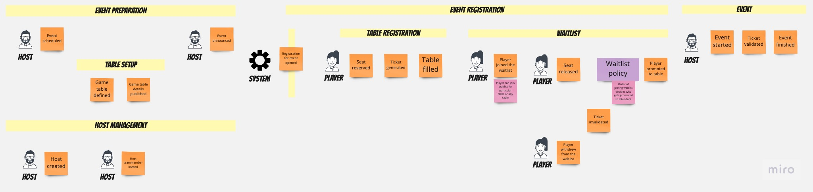
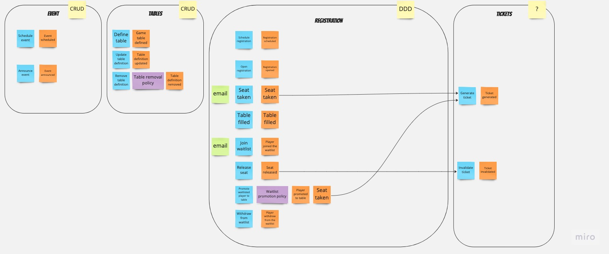

# GamingNight

Table of Contents
=================

* [Goal](#goal)
* [Plan](#plan)
* [Execution](#execution)
  * [Design](#design)
    * [Event Storming](#event-storming)
* [Documentation](#documentation)

# Goal
The goal of this project is implementation of a running distributed system with selected mix of latest technologies and architecture patterns.

# Plan

During design, I want to use:
* [Domain-Driven Design](https://www.amazon.pl/dp/0321125215?ref_=cm_sw_r_cp_ud_dp_KCVKDM5796FYT26B3AB4) approach to domain discovery and domain model design
* [Event Storming](https://www.eventstorming.com/) for domain discovery
* [Example Mapping](https://cucumber.io/blog/bdd/example-mapping-introduction/) for use cases discovery
* [C4 model](https://c4model.com/) for documentation
* [Architecture Decision Records](https://cognitect.com/blog/2011/11/15/documenting-architecture-decisions) for documenting architecture decisions

During implementation, I want to use:
* Event-Driven Architecture and messaging integration patterns selected by fit for the task
* Event Sourcing in one of the Bounded Contexts

System should be:
* deployable to Kubernetes cluster
* use 3rd party IdP
* use 3rd party AuthZ service
* use Message Broker
* use Redis
* use MongoDB

# Execution

## Design

### Event Storming

#### Big Picture Event Storming

#### Process Level Event Storming

# Documentation

## Architecture Decisions

<!-- adrlog -->

* [ADR-0001](doc/architecture/decisions/0001-record-architecture-decisions.md) - Record architecture decisions
* [ADR-0002](doc/architecture/decisions/0002-use-monorepo.md) - Use monorepo

<!-- adrlogstop -->

